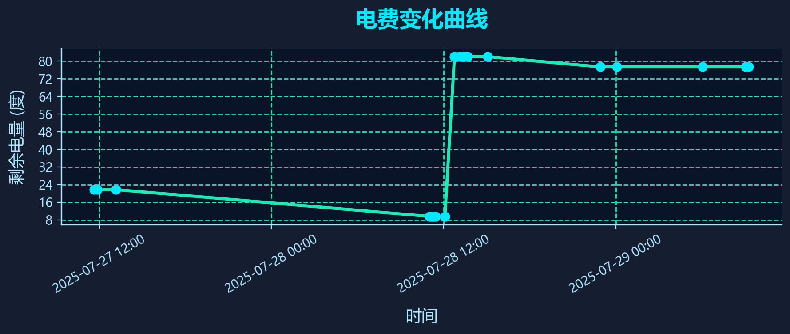

# 南京大学电费监控脚本

这是一个用于监控南京大学电费充值页面剩余电量的Python脚本，并提供可视化网页面板。

[](data/electricity_trend.png)

[点击查看电量数据表（CSV）](data/electricity_data.csv)

## 功能特性

- 自动登录南京大学电费充值系统
- 自动识别验证码（使用OCR）
- 提取剩余电量信息
- 支持无头模式运行
- 数据保存为JSON和CSV格式
- 详细的日志记录
- **可视化网页面板，支持交互式电量曲线与数据表格**
- 一键批处理启动与网页自动打开

## 环境要求

- Python 3.7+
- Chrome浏览器
- ChromeDriver（已包含在chromedriver-win64目录中）

## 安装依赖

```bash
pip install -r requirements.txt
```

## 使用方法

### 1. 环境测试（推荐）

在运行主脚本之前，建议先运行环境测试：

```bash
python tests/test_environment.py
```

### 2. 解决PIL兼容性问题（重要）

如果遇到 `module 'PIL.Image' has no attribute 'ANTIALIAS'` 错误，请运行：

```bash
python src/fix_pil_compatibility.py
```

### 3. 准备ChromeDriver

确保项目根目录下有 `chromedriver-win64` 文件夹，并包含 `chromedriver.exe` 文件。

### 4. 配置脚本

首次运行时会自动创建 `config.json` 配置文件，或者手动创建：

```json
{
    "username": "你的用户名",
    "password": "你的密码",
    "auto_login": true,
    "headless_mode": true,
    "captcha_retry_count": 5,
    "captcha_confidence_threshold": 0.3,
    "save_captcha_images": true,
    "log_level": "INFO"
}
```

### 5. 运行主监控脚本

#### 方法1：使用批处理文件（推荐）

```bash
run_auto_monitor.bat
```

#### 方法2：直接运行Python脚本

```bash
python src/nju_electric_monitor_auto.py
```

或指定配置文件：

```bash
python src/nju_electric_monitor_auto.py config.json
```

### 6. 启动可视化网页面板

#### 推荐方式：一键批处理启动

```bash
run_web_panel.bat
```

- 会自动激活虚拟环境并启动网页服务
- 自动用Edge或Chrome浏览器打开 http://127.0.0.1:5000/
- 支持桌面快捷方式

#### 手动方式

```bash
python src/web_panel.py
```

然后浏览器访问 http://127.0.0.1:5000/

### 7. 调试与测试工具

- 页面结构调试：
  ```bash
  python tests/debug_page_structure.py
  ```
- 验证码识别测试：
  ```bash
  python tests/test_captcha_recognition.py
  ```

## 输出文件

- `data/electricity_data.json`: 电量数据（JSON格式）
- `data/electricity_data.csv`: 电量数据（CSV格式）
- `nju_electric_monitor.log`: 运行日志
- `data/debug_page_source.html`: 页面源码（用于调试）
- `data/captcha_debug.png`: 验证码图片（用于调试）

## 网页面板功能

- 实时展示电量变化曲线（可缩放、拖动、悬停查看数据）
- 数据表格美观展示，支持一键刷新
- 科技感UI设计，适配桌面与移动端

## 注意事项

1. 确保Chrome浏览器版本与ChromeDriver版本兼容
2. 如果验证码识别失败，脚本会提示手动输入
3. 建议在无头模式下运行以提高性能
4. 请妥善保管登录凭据
5. **重要**：如遇PIL兼容性问题，请运行 `src/fix_pil_compatibility.py`
6. 如果无法提取电量信息，请运行 `tests/debug_page_structure.py` 分析页面结构
7. 如果验证码识别不正确，请运行 `tests/test_captcha_recognition.py` 测试识别效果

## 故障排除

### PIL兼容性问题（常见）

如果遇到 `module 'PIL.Image' has no attribute 'ANTIALIAS'` 错误：

1. **运行修复脚本**：

   ```bash
   python src/fix_pil_compatibility.py
   ```
2. **手动修复**：在脚本开头添加：

   ```python
   from pil_compatibility_patch import *
   ```
3. **降级Pillow版本**（如果修复脚本不起作用）：

   ```bash
   pip install Pillow==9.5.0
   ```

### 环境问题

如果遇到环境配置问题：

1. 运行 `python tests/test_environment.py` 检查环境配置
2. 确保所有依赖正确安装：`pip install -r requirements.txt`
3. 检查Python版本是否满足要求（>= 3.7）

### ChromeDriver问题

如果遇到ChromeDriver相关错误，请检查：

1. `chromedriver-win64/chromedriver.exe` 文件是否存在
2. ChromeDriver版本是否与Chrome浏览器版本匹配
3. 文件权限是否正确

### OCR识别问题

如果验证码识别失败：

1. 检查网络连接
2. 确保OCR模型已正确下载
3. 尝试手动输入验证码
4. 运行 `python tests/test_captcha_recognition.py` 测试识别效果
5. 调整配置文件中的 `captcha_confidence_threshold` 参数

### 电量信息提取问题

如果无法提取电量信息：

1. 运行 `python tests/debug_page_structure.py` 分析页面结构
2. 查看生成的 `data/debug_page_source.html` 文件
3. 根据分析结果调整脚本中的选择器

### 验证码识别问题

如果验证码识别不正确：

1. 运行 `python tests/test_captcha_recognition.py` 测试不同的图像处理方法
2. 查看生成的调试图片，选择最清晰的处理方法
3. 调整配置文件中的 `captcha_confidence_threshold` 参数
4. 如果自动识别效果不好，可以手动输入验证码

## 配置参数说明

- `captcha_retry_count`: 验证码识别重试次数（默认5次）
- `captcha_confidence_threshold`: 验证码识别置信度阈值（默认0.3）
- `save_captcha_images`: 是否保存验证码图片用于调试（默认true）

## 许可证

MIT License
